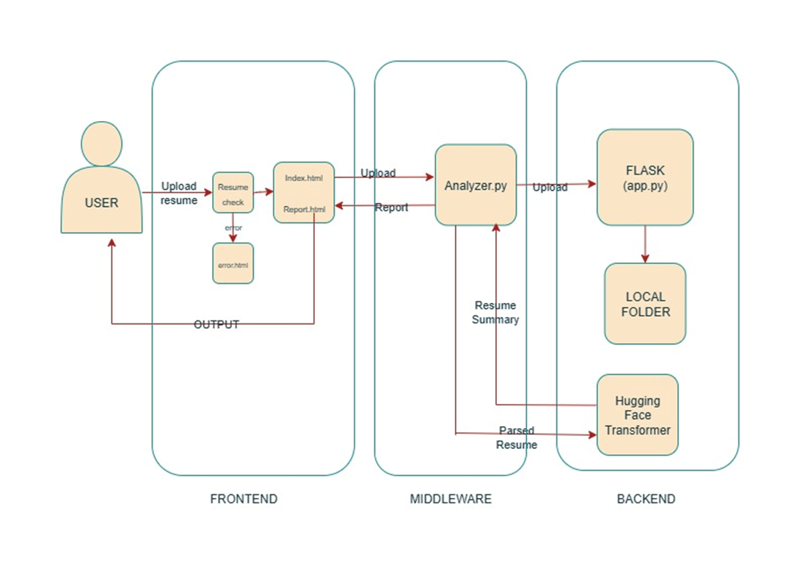

AI RESUME ANALYZER

Sriniharikakondepudi

Team member: Sri Niharika Kondepudi

An intelligent web application that uses Natural Language Processing (NLP) and AI to analyze resumes, score them against job descriptions, and provide personalized, actionable feedback for improvement.

You can check the live demo https://youtu.be/YXdmB9qWNDo

## Project Overview
Applying for jobs is a competitive process. Many companies use automated Applicant Tracking Systems (ATS) that can reject a well-qualified candidate due to simple formatting issues or a lack of specific keywords. This tool was built to help job seekers overcome this challenge.

The Resume Analyzer AI acts as a personal career assistant. It evaluates a resume's content, structure, and relevance to a specific job description, providing a detailed report with a final score and a clear action plan for improvement.

## Key Features
ATS-Friendly Section Parsing: A robust, line-by-line parser accurately finds key sections (Skills, Experience, etc.), even with non-standard titles.

Job Fit Scoring: Calculates a percentage match by performing a deep analysis of the keywords in a resume versus a job description.

AI-Generated Summary: Uses a Hugging Face transformer model to generate a concise, professional summary of the resume's content.

Personalized Action Plan: Provides a clear, prioritized to-do list of the most important changes a user can make to improve their resume.

Content & Impact Analysis:

Quantification Check: Flags work experience that lacks measurable metrics (numbers, %, $).

Buzzword Detection: Identifies generic corporate buzzwords that can weaken a resume.

Technology Freshness: Scans for and flags potentially outdated technologies to ensure the candidate's skills appear current.

OCR for Image-Based PDFs: Automatically uses Tesseract OCR to extract text from scanned or image-based resumes that standard tools cannot read.

Smart Default Profiles: If no job description is provided, the analyzer intelligently infers the job field (e.g., Software, Marketing, SCM) and uses a relevant default profile for comparison.

Downloadable Reports: Users can download their detailed analysis report as a PDF with a single click.

## Architecture
This project is a monolithic web application built with Flask. It uses a server-side rendering approach where the Python backend performs all the analysis and then renders an HTML template with the results.

## Technology Stack
Backend	Python, Flask

NLP & AI	spaCy, Hugging Face Transformers

Parsing	PyMuPDF, python-docx

OCR	Tesseract, Pillow

Frontend	HTML, CSS, JavaScript

## Local Setup and Installation
To run this project on your local machine, follow these steps.

Prerequisites:

Python 3.9+

Git

Tesseract OCR (you must install this on your system for the OCR feature to work. See the official Tesseract installation guide).

## Installation Steps:

Clone the repository:

git clone https://github.com/NiharikaKondepudi/AI_RESUME_ANALYZER_BASED_ON_ATS

cd AI_RESUME_ANALYZER_BASED_ON_ATS

## Create and activate a virtual environment:

python -m venv venv

On Windows, use: 
venv\Scripts\activate

On mac, use:
source venv/bin/activate

## Install all required Python packages:

pip install -r requirements.txt

## Download the spaCy NLP model:

python -m spacy download en_core_web_sm

## Run the web application:

python app.py

## Open your web browser

navigate to http://127.0.0.1:5000.

## How to Use
Navigate to the web application in your browser.

Click the "Upload Resume" button and select a PDF or DOCX file.

Paste the text of a job description into the text area. If left blank, the analyzer will use a smart default.

Click the "Analyze My Resume" button and wait for your report to be generated.

On the report page, you can click "Download Report as PDF" or "Analyze Another Resume".

## WHAT YOU GET
Now you can follow the steps said shown in the report

The report gives you the changes you should make so that your resume will teh pass the ATS scoring.
